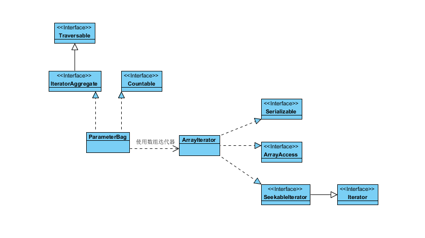

### PHP额外的数据结构: https://github.com/morrisonlevi/Ardent

处理类: Kernel
请求类: Request
响应类: Response

```php
// public/index.php

// 1.创建一个内核类
$kernel = new Kernel($env, $debug);

// 2.用静态方法生成一个Request对象
$request = Request::createFromGlobals();

// 3.根据Request对象,获取Response对象
$response = $kernel->handle($request);

// 4.发送HTTP headers 和 content.
$response->send();

// 5.内核终止
$kernel->terminate($request, $response);
```


#### ParameterBag类解析
```php
class ParameterBag implements \IteratorAggregate, \Countable
{
}
```

ParameterBag类是一个[迭代器模式](https://blog.csdn.net/lovelion/article/details/9992005)的应用. 实现了聚合接口IteratorAggregate, getIterator接口方法返回的是ArrayIterator(数组迭代器), 这个迭代器允许在遍历数组和对象时删除和更新值与键.




ParameterBag类使用
```
$parameters = array('foo' => 'bar', 'hello' => 'world');
$bag = new ParameterBag($parameters);

$i = 0;
foreach ($bag as $key => $val) {
   ++$i;
   $this->assertEquals($parameters[$key], $val);
}

$this->assertEquals(count($parameters), $i);
```


IteratorAggregate接口继承的是Traversable接口,表示该接口可以被foreach函数进行遍历
```php
IteratorAggregate extends Traversable {
    /* 方法 */
    abstract public Traversable getIterator ( void )
}
```

IteratorAggregate接口的使用
```php
class Collection implements IteratorAggregate
{
    private $array = [];
    const TYPE_INDEXED     = 1;
    const TYPE_ASSOCIATIVE = 2;

    public function __construct(array $data, $type = self::TYPE_INDEXED)
    {
        reset($data);
        while (list($k, $v) = each($data))
        {
            $type == self::TYPE_INDEXED ?
                $this->array[] = $v :
                $this->array[$k] = $v;
        }
    }

    public function getIterator()
    {
        return new ArrayIterator($this->array);
    }
}

$obj = new myData(['one' => 'php', 'javascript', 'three' => 'c#', 'java',], /*TYPE 1 or 2*/ );

foreach ($obj as $key => $value)
{
    var_dump($key, $value);
    echo PHP_EOL;
}

// if TYPE == 1
#int(0)
#string(3) "php"
#int(1)
#string(10) "javascript"
#int(2)
#string(2) "c#"
#int(3)
#string(4) "java"

// if TYPE == 2
#string(3) "one"
#string(3) "php"
#int(0)
#string(10) "javascript"
#string(5) "three"
#string(2) "c#"
#int(1)
#string(4) "java"

```


我们先看看ArrayIterator的使用
```php
/**
 * This iterator allows to unset and modify values and keys while iterating
 * over Arrays and Objects.
 * @link http://php.net/manual/en/class.arrayiterator.php
 */
class ArrayIterator implements SeekableIterator, ArrayAccess, Serializable, Countable {
}
```

ArrayIterator实现了SeekableIterator, ArrayAccess, Serializable, Countable接口. 总结成一句话就是,ArrayIterator实现ArrayAccess拥有了数组的存值、取值的能力，实现Serializable拥有了序列化的能力，实现Countable拥有了count($obj)的能力,实现SeekableIterator拥有可以遍历的能力和查找元素的能力

我们分别看下每个接口的作用

#### Countable接口
> 实现Countable接口中的count方法, 当对对象进行count($obj)的时候，会调用对象的count方法
```php
class CountMe implements Countable
{
    protected $_myCount = 3;

    public function count()
    {
        return $this->_myCount;
    }
}

$countable = new CountMe();
echo count($countable); //result is "3" as expected
```

#### ArrayAccess(数组式访问)接口
> 提供像访问数组一样访问对象的能力的接口
```php
class ObjArray implements ArrayAccess
{
    private $container = [];

    public function __construct()
    {
        $this->container = [
            'one'   => 1,
            'two'   => 2,
            'three' => 3,
        ];
    }

    public function offsetSet($offset, $value)
    {
        if (null === $offset)
        {
            $this->container[] = $value;
        } else
        {
            $this->container[$offset] = $value;
        }
    }

    public function offsetExists($offset)
    {
        return isset($this->container[$offset]);
    }

    public function offsetUnset($offset)
    {
        unset($this->container[$offset]);
    }

    public function offsetGet($offset)
    {
        return isset($this->container[$offset]) ? $this->container[$offset] : null;
    }
}

$obj = new ObjArray();

var_dump(isset($obj["two"]));
var_dump($obj["two"]);
unset($obj["two"]);
var_dump(isset($obj["two"]));
$obj["two"] = "A value";
var_dump($obj["two"]);
$obj[] = 'Append 1';
$obj[] = 'Append 2';
$obj[] = 'Append 3';
print_r($obj);

输出:
bool(true)
int(2)
bool(false)
string(7) "A value"
obj Object
(
    [container:obj:private] => Array
        (
            [one] => 1
            [three] => 3
            [two] => A value
            [0] => Append 1
            [1] => Append 2
            [2] => Append 3
        )

)
```

#### Serializable接口
> 自定义实现序列化的接口
```php
class ObjSerialize implements Serializable
{
    private $data;
    public function __construct() {
        $this->data = "My private data";
    }
    public function serialize() {
        return serialize($this->data);
    }
    public function unserialize($data) {
        $this->data = unserialize($data);
    }
    public function getData() {
        return $this->data;
    }
}

$obj = new ObjSerialize;
$ser = serialize($obj);

$newobj = unserialize($ser);

var_dump($newobj->getData());

// 输出结果
// string(15) "My private data"
```

#### SeekableIterator(查找元素迭代器)接口
> 实现seek查找方法,可以查找指定元素，同时需要实现迭代器接口，完成容器的循环功能
```php
SeekableIterator extends Iterator {
    /* 方法 */
    abstract public void seek ( int $position )
    /* 继承的方法 */
    abstract public mixed Iterator::current ( void )
    abstract public scalar Iterator::key ( void )
    abstract public void Iterator::next ( void )
    abstract public void Iterator::rewind ( void )
    abstract public bool Iterator::valid ( void )
}
``
```php
class ObjSeekIterator implements SeekableIterator
{
    private $position;

    private $array = array(
        "first element",
        "second element",
        "third element",
        "fourth element"
    );

    /* Method required for SeekableIterator interface */
    public function seek($position) {
        if (!isset($this->array[$position])) {
            throw new OutOfBoundsException("invalid seek position ($position)");
        }

        $this->position = $position;
    }

    /* Methods required for Iterator interface */
    public function rewind() {
        $this->position = 0;
    }

    public function current() {
        return $this->array[$this->position];
    }

    public function key() {
        return $this->position;
    }

    public function next() {
        ++$this->position;
    }

    public function valid() {
        return isset($this->array[$this->position]);
    }
}


try {

    $it = new ObjSeekIterator();
    echo $it->current(), "\n";

    $it->seek(2);
    echo $it->current(), "\n";

    $it->seek(1);
    echo $it->current(), "\n";

    $it->seek(10);

} catch (OutOfBoundsException $e) {
    echo $e->getMessage();
}
// 输出
// first element
// third element
// second element
// invalid seek position (10)
```
