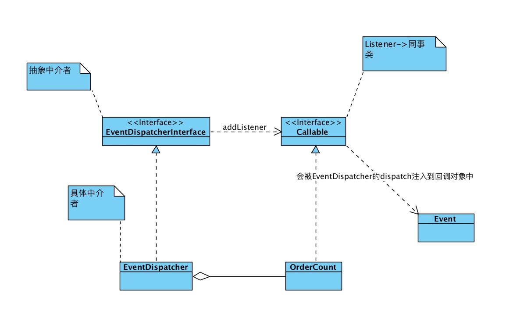

> symfony EventDispatcher组件是用[中介者模式](https://blog.csdn.net/lovelion/article/details/8482952)来实现的. 中介者模式的核心概念是，各个同事类的对外调用同事类，都是走中介者，不要直接去调用

### 中介者模式实现事件处理的简化版
```php
class Mediator {
    protected $events = array();
    public function attach($eventName, $callback) {
        if (!isset($this->events[$eventName])) {
            $this->events[$eventName] = array();
        }
        $this->events[$eventName][] = $callback;
    }
    public function trigger($eventName, $data = null) {
        foreach ($this->events[$eventName] as $callback) {
            $callback($eventName, $data);
        }
    }
}
$mediator = new Mediator;
$mediator->attach('load', function() { echo "Loading"; });
$mediator->attach('stop', function() { echo "Stopping"; });
$mediator->attach('stop', function() { echo "Stopped"; });
$mediator->trigger('load'); // prints "Loading"
$mediator->trigger('stop'); // prints "StoppingStopped"
// 对象就可以保存在某个对象内部，来触发事件发生，或者被调用触发
```

我们来分析一下symfony事件触发器的基本结构是怎么做的?
A. 简单的应用
```php
class OrderCount
{
    public function onAdd(Event $event, $eventName, EventDispatcher $dispatcher)
    {
        echo '新增一个订单了,加入统计系统.';
    }
}

class OrderNewEvent extends Event
{
    public const name = 'order.new'; // 新增订单事件
}

// 声明一个事件调度器(中介者)
$dispatcher = new EventDispatcher();
// 声明回调类型，通过addListener加入到中介者中
$dispatcher->addListener(OrderNewEvent::name, [new OrderCount(), 'onAdd']);
// 通过中介者对象，调用回调对象
$dispatcher->dispatch(OrderNewEvent::name, new OrderNewEvent());
```
UML类图:



```php
// 结合业务类的用法
class OrderCount
{
    public function onAdd(Event $event, $eventName, EventDispatcher $dispatcher)
    {
        echo '新增一个订单了,加入统计系统.';
    }
}

class OrderNewEvent extends Event
{
    public function __construct(Order $order)
    {

    }

    public const name = 'order.new'; // 新增订单事件
}

class Order
{
    private $dispatcher;
    private $no;

    // 新增一个订单
    public function create()
    {
        $this->dispatcher->dispatch(OrderNewEvent::name, new OrderNewEvent($this));
    }

    public function setDispatcher(EventDispatcher $dispatcher)
    {
        $this->dispatcher = $dispatcher;
    }

}


// 声明一个事件调度器(中介者)
$dispatcher = new EventDispatcher();
// 把同事类声明为回调类型，加入到中介者中
$dispatcher->addListener(OrderNewEvent::name, [new OrderCount(), 'onAdd']);

$order = new Order();
$order->setDispatcher($dispatcher);
$order->create();
```


B. 实现订阅器来使用事件调度器(Using Event Subscribers)


```php
// 事件调度在Console组件中的应用
// ConsoleEvents::ERROR
// ErrorListener
```


https://blog.ircmaxell.com/2012/03/handling-plugins-in-php.html
https://symfony.com/doc/current/components/event_dispatcher.html
